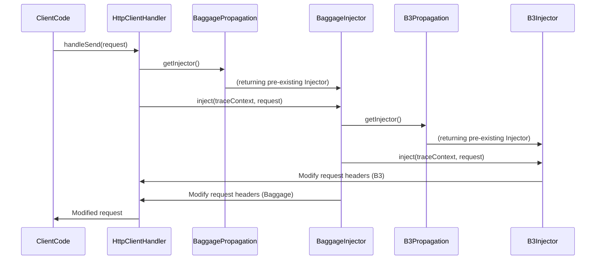
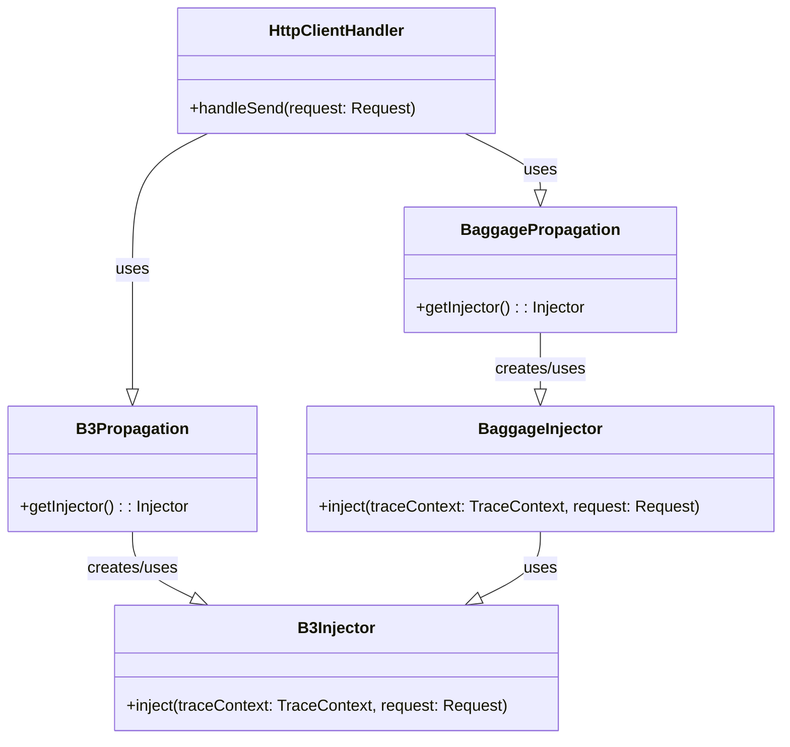

Keyword: Spring, Spring Cloud, Spring Cloud Sleuth, Kotlin, Brave, Distributed Tracing

## Getting Started

### Introduction

Spring Cloud Sleuth는 OpenZipkin의 Brave 라이브러리를 Spring Cloud에 integration한 라이브러리이다.

즉, Spring Cloud Sleuth는 Brave를 Spring Cloud에 integration 해주는 역할이고

Brave 라이브러리가 실제 tracing 정보 생성 및 관리하는 역할이다.

> Spring Cloud Sleuth 2.0 이상에 해당

### Terminology

- Trace: Span 집합.
- Span: 작업 단위. (unit-of-work) 다른 서비스로 요청을 보내는 것은 새로운 span에 해당함. 반복문 코드에서 한 번의 iteration은 새로운 span으로 취급할 수 있음.

### Spring Cloud Setup

공식 문서 또는 다른 블로그를 참고하자.

## Spring Cloud Sleuth Usage

<https://docs.spring.io/spring-cloud-sleuth/docs/3.1.9/reference/htmlsingle/spring-cloud-sleuth.html#using-span-lifecycle>

- spring-cloud-sleuth-api 모듈에 인터페이스들이 정의되어 있음.
- Spring Cloud Sleuth는 OpenZipkin Brave 구현체를 포함함.
- Sleuth와 Brave의 연결(bridge)은 `org.springframework.cloud.sleuth.brave.bridge` 패키지를 참고. (여러 모듈들이 이 패키지를 가지고 있다.)

## 3.1.1. Creating and Ending Spans

<https://docs.spring.io/spring-cloud-sleuth/docs/3.1.9/reference/htmlsingle/spring-cloud-sleuth.html#using-creating-and-ending-spans>

Trace context가 없을 때 Sleuth Tracer를 통해 "직접(manually)" span을 만드는 방법을 소개한다.

> (Sleuth에 의해) 자동으로 span이 생성되지 않는 코드 위치에서 사용할 수 있다.

> Sleuth Tracer는 DI(autowire) 받아서 사용할 수 있다.

> Sleuth Tracer와 별개로 Brave Tracer가 있다. Sleuth는 Brave를 추상화하여 Sleuth의 Tracer를 제공한다.

> Java의 try-with-resources 구문을 통해 try block이 끝난 후 SpanInScope.close()가 호출되도록 하고 있다. scope close과 별개로 span의 start/end를 명시적으로 호출해줘야 한다. 이는 span의 수행시간 측정 및 tracing backend로 span을 report하기 위해 필요하다.

> Kotlin에서는 try-with-resources 구문의 대안으로 `Closable.use(block)` 메소드가 제공된다.

## 3.1.3. Creating a Span with an explicit Parent

<https://docs.spring.io/spring-cloud-sleuth/docs/3.1.9/reference/htmlsingle/spring-cloud-sleuth.html#using-creating-spans-with-explicit-parent>

Trace context가 있을 때 child span을 생성, 즉 하위 작업을 나눌 때 필요하다.

> 여러 하위 작업들이 존재할 때 child span을 생성하여 각 작업의 수행시간이나 로그를 식별할 때 편리하다. 특히 작업들이 동시에 병렬로 수행될 때 더 유용하다.

## 3.3.1. Creating New Spans

<https://docs.spring.io/spring-cloud-sleuth/docs/3.1.9/reference/htmlsingle/spring-cloud-sleuth.html#using-annotations-new-spans>

Sleuth를 사용하면 `@NewSpan` 어노테이션을 통해 span이 생성되도록 할 수 있다.

> span naming이나 tagging은 Zipkin 등 traacing backend를 사용할 때 활용할 수 있는 옵션이다. 본인은 사용하지 않는 옵션이므로 설명을 생략한다.

## 4. Spring Cloud Sleuth Features

<https://docs.spring.io/spring-cloud-sleuth/docs/3.1.9/reference/htmlsingle/spring-cloud-sleuth.html#project-features>

Sleuth가 제공해주는 기능들에 대해서 설명해준다. 가장 중요한 것은 Trace context propagation이다. 다른 서비스를 호출할 때 trace id, span id 등을 요청 헤더에 포함하여 보냄으로써 context를 전파하는 것이다.

Sleuth는 Brave를 따라 B3 header를 사용한다. (몇몇 사람들은 이것을 "Zipkin을(또는 Zipkin 헤더를) 사용한다"라고 모호하게 표현한다.)

<https://github.com/openzipkin/b3-propagation>

## 4.3. Baggage

<https://docs.spring.io/spring-cloud-sleuth/docs/3.1.9/reference/htmlsingle/spring-cloud-sleuth.html#features-baggage>

Sleuth와 Brave는 Trace context 외에 추가적인 정보(필드)들을 전파하는 기능을 제공하고, 이러한 필드들을 Baggage라고 부른다.

Brave Baggage: <https://github.com/openzipkin/brave/tree/master/brave#baggage>

local/remote 차이에 따라 baggage field는 서비스 내부 혹은 외부까지 전파될 수 있다.

이 기능을 언급하는 글을 못 찾았는데, MSA 환경에서 이 기능은 유용하다.

## 4.4. OpenZipkin Brave Tracer Integration

<https://docs.spring.io/spring-cloud-sleuth/docs/3.1.9/reference/htmlsingle/spring-cloud-sleuth.html#features-brave>

Sleuth 또는 Brave 둘 중 한 쪽의 API를 선택해서 사용할 수 있다. Brave API를 사용할 경우 Brave의 문서를 참고하자. (Sleuth 문서의 링크들을 참고하자.)

baggage, MDC 등 

## Preceding posts

Official Docs: <https://docs.spring.io/spring-cloud-sleuth/docs/3.1.9/reference/htmlsingle/spring-cloud-sleuth.html#_important>

아래는 Sleuth를 검색했을 때 검색된 블로그 포스트들 중 약 30개 정도를 읽어보고, 읽어볼만한 포스트들을 선별하였다.

<https://bistros.tistory.com/182>
<https://assu10.github.io/dev/2021/01/31/spring-cloud-log-tracker4/>
<https://duooo-story.tistory.com/65>

Spring Cloud Sleuth의 내부 속으로
- <https://blog.naver.com/gngh0101/221528363196>
- <https://blog.naver.com/gngh0101/221574435601>
- <https://blog.naver.com/gngh0101/221796656166>

